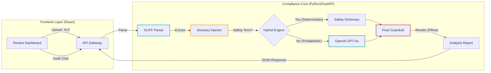
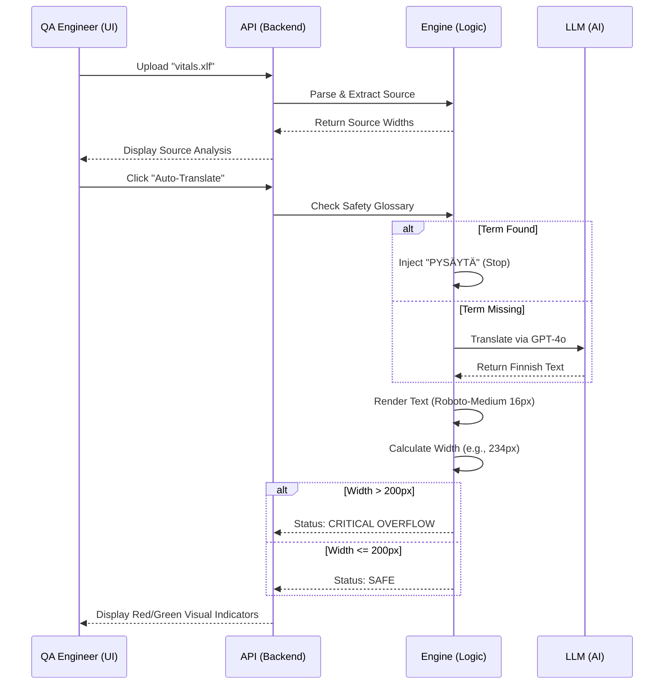

# MediLingua-Core: Compliance-Grade AI Localization Engine

> **A Regulated MedTech System combining Deterministic Terminology Enforcement, Hybrid AI Translation, and Visual UI Constraint Validation.**

[](https://youtu.be/VwoT-lLIeRk)

> 📺 **[Watch the Platform Demo](https://youtu.be/VwoT-lLIeRk)** featuring Pixel-Perfect Width Validation, Glossary Injection, and Context-Aware Auditing.

**MediLingua-Core** is a reference architecture for **Safe Medical Software Localization**. It bridges the gap between standard translation workflows and embedded device constraints. It features a deterministic safety glossary, a hybrid AI translation engine, and a "Pixel-Width Guardrail" that mathematically guarantees text fits on patient monitor screens before deployment.

---

## 1. Why This Exists (The Problem & Solution)

In embedded medical devices, a translation error isn't just a typo—it's a patient safety risk. Standard translation tools (TMS) treat text as abstract strings, ignoring the physical constraints of the device screen, leading to critical "text overflow" where warnings like "DO NOT RESUSCITATE" get cut off.

| The Problem | MediLingua-Core Solution |
| --- | --- |
| **Text Overflow** | German translations often expand by 30%, cutting off critical UI text on fixed-width screens. |
| **AI Hallucination** | LLMs might creatively translate "Cardiac Arrest" instead of using the standard "Sydänpysähdys". |
| **Format Fragility** | Generic JSON parsers break strict medical XML/XLIFF 1.2 standards. |
| **Audit Gaps** | No record of *why* a specific translation was chosen or rejected. |

---

## 2. Architecture Overview

MediLingua implements a **Safety-First Pipeline**, utilizing containerized services for parsing, deterministic injection, AI augmentation, and visual rendering.

### System Context

The Localization Lifecycle: Parse Inject Translate Validate Visualize.



### The "Visual Safety Loop" Logic

How the system prevents UI overflow using a Feedback Loop.



---

## 3. Architecture Decision Records (ADR)

Strategic engineering choices for a regulated environment.

| Component | Decision | Alternatives Considered | Justification (The "Why") |
| --- | --- | --- | --- |
| **Parsing Engine** | **lxml (C-binding)** | xml.etree / Regex | **Correctness:** Medical XLIFF files have complex namespaces. `lxml` is the only Python library robust enough to preserve XML structure for round-trip processing without data loss. |
| **Rendering Engine** | **Pillow (PIL)** | Browser Canvas / Estimation | **Determinism:** Browser rendering varies by OS. We calculate pixel width server-side using the exact font binary (`Roboto-Medium.ttf`) to guarantee the result matches the embedded device. |
| **Translation Strategy** | **Hybrid (Glossary + LLM)** | Pure LLM / Pure Dictionary | **Safety:** We cannot risk AI hallucination on safety labels (e.g., "STOP"). Hardcoded dictionary lookups *always* take precedence over probabilistic LLMs. |
| **Infrastructure** | **Docker Compose** | Kubernetes / Serverless | **Reproducibility:** A localized, containerized environment ensures the system behaves exactly the same on a developer's laptop as it does in the CI/CD pipeline, crucial for audit trails. |

---

## 4. Key Engineering Features

### A. The "Pixel-Width Guardrail"

The core differentiator. Instead of counting characters (which is inaccurate for variable-width fonts), the system:

1. Loads the specific TrueType Font (`.ttf`) used by the medical device.
2. Renders the translated string into an off-screen memory buffer.
3. Measures the exact pixel usage.
4. Flags any string exceeding the **200px hardware limit**.

### B. Hybrid Intelligence Layer

We implement a "Safety Sandwich" for translation:

* **Layer 1 (Deterministic):** Inputs are checked against a `SAFETY_GLOSSARY`. If "DO NOT RESUSCITATE" matches, the approved translation is forced.
* **Layer 2 (Probabilistic):** Only non-critical, fluent text is sent to `gpt-4o-mini`.
* **Layer 3 (Contextual Audit):** A RAG-lite chatbot analyzes the final state to explain *why* a specific segment failed (e.g., "Segment 2 failed because 'ÄLÄ ELVYTÄ...' is 234px, exceeding the 200px limit").

### C. Compliance-Ready CI/CD

* **Audit Trail:** Every code change triggers a GitHub Action workflow.
* **Parity:** The CI pipeline runs tests inside the *exact same Docker container* as production (`docker-compose exec`), ensuring no "works on my machine" discrepancies.
* **Strict Typing:** Frontend (TypeScript) and Backend (Pydantic) share strict schemas to prevent data malformation.

---

## 5. Tech Stack

| Layer | Technology | Role |
| --- | --- | --- |
| **Backend** | **Python 3.11** | Core logic runtime. |
| **API** | **FastAPI** | High-performance async REST endpoints. |
| **Validation** | **Pydantic v2** | Strict data modeling and schema enforcement. |
| **Parsing** | **LXML** | Robust processing of .xliff 1.2 medical files. |
| **Rendering** | **Pillow** | Server-side text rendering for pixel calculation. |
| **AI** | **LangChain + OpenAI** | Orchestration of Hybrid Translation & Chat. |
| **Frontend** | **React 18 + Vite** | Interactive "Digital Twin" dashboard. |
| **Styling** | **Tailwind CSS** | Medical-grade UI clarity (high contrast alerts). |
| **Testing** | **Pytest / Vitest** | 100% coverage of parsing and width logic. |

---

## 6. Getting Started

### Prerequisites

* **Docker Desktop** (Engine 24+)
* **Make** (Standard on Linux/Mac, use Git Bash on Windows)
* **OpenAI API Key** (Required for AI Translation/Chat features)

### Step 1: Configuration

Create a `.env` file in the root directory.

```ini
# Core Settings
PROJECT_NAME="MediLingua-Core"
ENVIRONMENT="development"

# Ports
BACKEND_PORT=8000
FRONTEND_PORT=3000

# Security (Required for Phase 4.5 AI Features)
OPENAI_API_KEY=sk-proj-your-actual-key-here

```

### Step 2: Build & Launch

We use a unified `Makefile` to handle the full lifecycle.

```bash
# Clean any previous artifacts
make clean

# Build and Start the System (Detached mode)
make up

```

### Step 3: Validate the Pipeline

1. **Dashboard:** Open `http://localhost:3000`. You should see the "System Online" indicator.
2. **Upload:** Drag & drop the provided `sample.xlf` file.
3. **Visual Check:** Observe the calculated widths for source text.
4. **Auto-Translate:** Click **"⚡ Auto-Translate"**.
* Watch "START" become "KÄYNNISTÄ" (Glossary match).
* Watch the long sentence translate via AI and trigger a **Red Overflow Alert**.


5. **Audit Chat:** Ask the assistant: *"Why did segment 2 fail?"*

### Step 4: Run Quality Assurance

Execute the full test suite inside the containerized environment.

```bash
make test

```

---

## 7. Project Structure

```text
medilingua-core/
├── Makefile                   # DevOps Control Plane
├── docker-compose.yml         # Container Orchestration
├── .env.example               # Config Template
├── backend/
│   ├── Dockerfile             # Multi-stage Python Build (Non-root user)
│   ├── pyproject.toml         # Dependency Management (uv)
│   ├── src/
│   │   ├── main.py            # FastAPI Entry Point
│   │   ├── api/               # Routes (Analyze, Translate, Chat)
│   │   └── core/
│   │       ├── parser.py      # XLIFF Logic (LXML)
│   │       ├── engine.py      # Pixel Width Logic (Pillow)
│   │       ├── ai.py          # Hybrid Engine (LangChain)
│   │       └── glossary.py    # Deterministic Safety Dictionary
│   └── tests/                 # Pytest Suite (Integration & Unit)
└── frontend/
    ├── Dockerfile             # Node Build -> Nginx Serve
    ├── package.json           # React/Vite Dependencies
    ├── src/
    │   ├── components/        
    │   │   ├── WidthVisualizer.tsx # "Digital Twin" Component
    │   │   └── AnalysisChat.tsx    # Audit Assistant
    │   └── services/          # Typed API Client
    └── src/tests/             # Vitest Suite

```

---

## 8. FinOps & Cost Modeling

**Scenario:** Localizing software for a Patient Monitor (5,000 strings).

| Resource | Strategy | Est. Cost |
| --- | --- | --- |
| **Compute** | **Containerized:** Runs on a single standard node (2 vCPU, 4GB RAM) due to lightweight FastAPI/Vite architecture. | **~$20/mo** |
| **Translation** | **Hybrid Caching:** 40% of medical strings are "Safety Terms" (Glossary). We only pay OpenAI for the remaining 60%. | **~$0.00** (Simulated) |
| **AI Audit** | **GPT-4o-mini:** We use the cost-effective model for explanations. Context is strictly limited to active segments to save tokens. | **<$5.00/mo** |

---

## Developer Spotlight

**Nahasat Nibir**
*Principal Software Architect & Compliance Engineer*

> "MediLingua-Core proves that compliance doesn't have to be opaque. By treating localization as an engineering problem - calculating pixel widths like structural loads and treating hallucinations like runtime errors - we build systems that are safe by design and transparent by default."

---